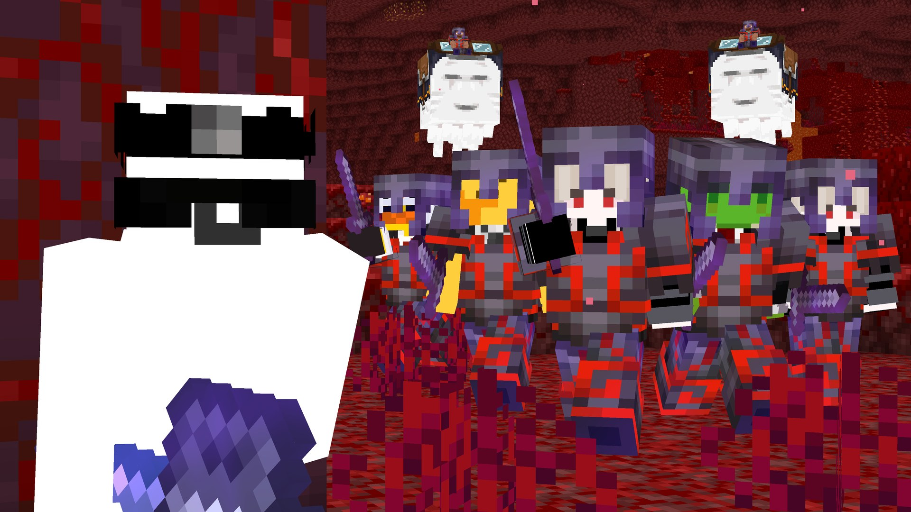
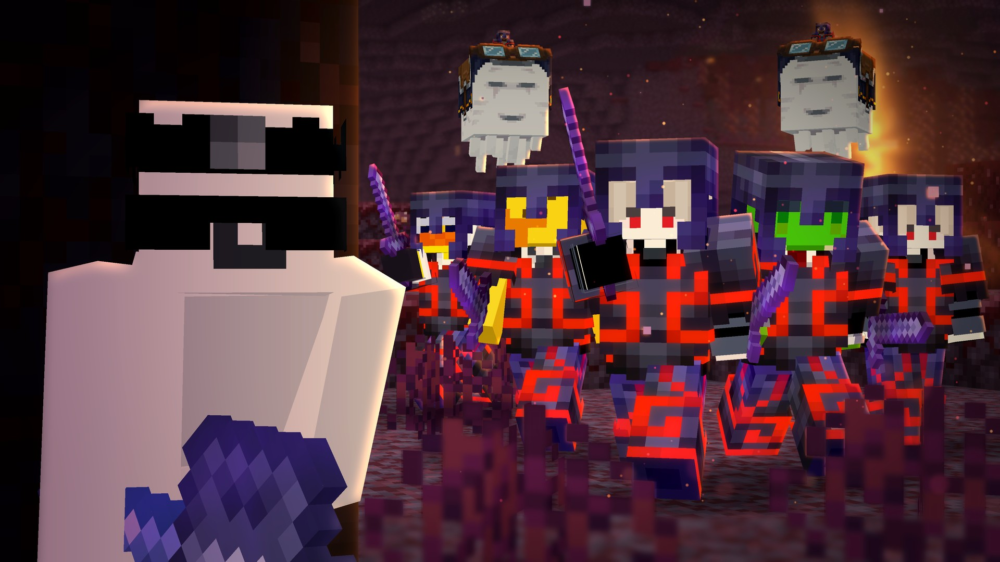

# Minecraft Thumbnail Vault

Minecraft YouTube kapak fotoğraflarını (thumbnail) **Photoshop / Photopea** ile yapmak için öğrenilen her şey. Tutorial videolar kare kare izlenip değerleriyle birlikte not alındı. Aynı klasör hem bir Claude Code skill'i hem de GitHub reposu.

## Örnek: bu plugin'le yapılan bir iş
Ham render geçişleri (üst üste, düzenlenmemiş) → son thumbnail. Ayrıntılar: [README](README.md) → Example.

## Adım adım süreç
| # | Teknik | Kısaca |
|---|---|---|
| 1 | [Render hazırlığı](techniques/01-render-prep.md) | Aynı kameradan shader'sız, NMS ve DMS render'ları |
| 2 | [Belge kurulumu](techniques/02-document-setup.md) | 1920x1080, render'ları katman olarak al |
| 3 | [NMS gölgelendirme](techniques/03-nms-shading.md) | Color Range, Fuzziness 200, siyah %18, beyaz Overlay %10 |
| 4 | [Depth map sis](techniques/04-depth-map-fog.md) | Solid Color #c7e8ff + depth maske + Curves |
| 5 | [Camera Raw](techniques/05-camera-raw.md) | Preset değerleri |
| 6 | [Ortam ışığı (Layer Style)](techniques/06-layer-style-ambient-light.md) | Gradient Overlay + Inner Glow + Inner Shadow |
| 7 | [Elle gölge](techniques/07-hand-shadows.md) | Polygonal Lasso, %62 |
| 8 | [Renk değiştirme](techniques/08-recolor.md) | Quick Selection, Soft Light %36 |
| 9 | [Glow](techniques/09-glow.md) | Soft fırça, Linear Dodge |
| 10 | [Gökyüzü ve asset'ler](techniques/10-sky-and-assets.md) | Sky, kar, lens flare (Screen) |
| 11 | [Highlight](techniques/11-highlights.md) | 3–5 px, karakterin içinde, uçları sivrilt, Overlay |
| 12 | [Export](techniques/12-export.md) | PNG, güncel YouTube limitleri |
| – | [Referansa göre uyarlama](techniques/adapt-to-reference.md) | Sipariş/referansa göre hangi ayar nasıl değişir |
| – | [Photopea uyumluluğu](techniques/photopea-compatibility.md) | Her adımın Photopea karşılığı |

## Tarzlar
Her thumbnail aynı tarzda değil. Sipariş gelince önce tarz seçilir: [Tarz rehberi](styles/README.md)

| Kod | Tarz |
|---|---|
| S1 | [Temiz render](styles/01-clean-render.md) (ana iş akışı) |
| S2 | [Sinematik](styles/02-cinematic.md) |
| S3 | [SMP / drama](styles/03-smp-drama.md) |
| S4 | [Split / ilerleme](styles/04-split-progression.md) |
| S5 | [Hardcore / survival](styles/05-hardcore-survival.md) |
| S6 | [Speedrun / manhunt / PvP](styles/06-speedrun-manhunt-pvp.md) |
| S7 | [Korku](styles/07-horror.md) |
| S8 | [Build / showcase](styles/08-build-showcase.md) |
| S9 | [Çizim / 2D](styles/09-drawn-2d.md) |
| S10 | [Meme / lo-fi](styles/10-meme-lofi.md) |
| S11 | [Shorts](styles/11-shorts.md) |

## Tarza özel teknikler
- [Karakteri öne çıkarma](techniques/character-pop.md) · [Yazı](techniques/text-typography.md) · [Aksiyon efektleri](techniques/action-effects.md) · [Tarz teknikleri kataloğu (taslak)](techniques/style-catalog.md)

## Rehberler
- [Sipariş akışı](guides/order-workflow.md): uçtan uca adımlar, kullanıcının çalışma tercihleri, `compose.py` iskeleti, kodla üretim tuzakları
- [Dikkat edilecekler](guides/pitfalls.md): YouTube politikası, Mojang kuralları, lisanslar, sipariş/teslim, en sık 10 hata
- [Yaygın hatalar → düzeltme](guides/common-mistakes.md)

## Kaynaklar
- [Spare — How to Make CLEAN Minecraft Thumbnails](sources/spare-clean-thumbnails.md)
- [zestu's studio — How to do Highlights](sources/zestu-highlights.md)
- [Spare — render kısmı (0:00–6:27)](sources/spare-clean-thumbnails-render-part.md)
- [ItsProger — Blender ile temiz render](sources/itsproger-blender-clean-renders.md)
- [Nebular — SB737 aksiyon thumbnail'i](sources/nebular-sb737-action-thumbnail.md)
- [Schxnappi_ — layer style ve yazı](sources/schxnappi-layer-styles-text.md)
- [Pqtrick — thumbnail düzeltme (eleştiri)](sources/pqtrick-fixing-thumbnails.md)
- [Swiffex — Photopea ile Unstable SMP](sources/swiffex-photopea-unstable-smp.md)

## Referanslar
- [Referans kütüphanesi ve analiz listesi](references/README.md)
- [Referanslardan öğrenilenler](references/lessons.md)
- Obsidian'da görsel galeri: `references/gallery.base`

## Siparişler
- `/mcthumb:order` ile açılır, `orders/` klasöründe sadece yerelde durur. Şablon: [templates/order.md](templates/order.md)

## Geliştirme
- [Yol haritası](dev/roadmap.md) · [Değişiklik günlüğü](dev/changelog.md)
- Yeni oturumlar için kurallar: [AGENTS.md](AGENTS.md)
