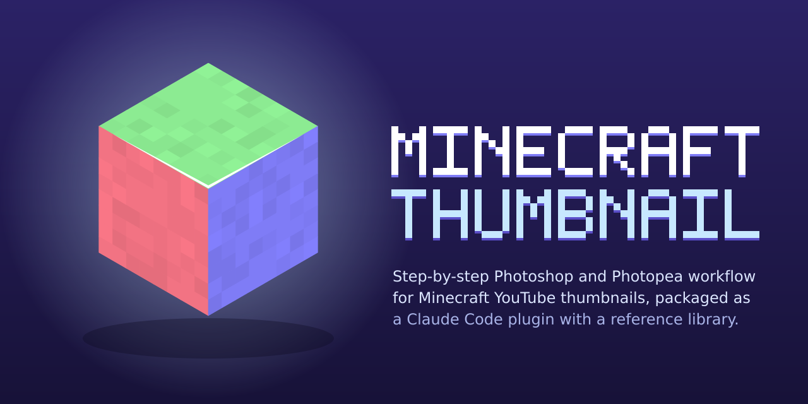

<p align="center"></p>

# Minecraft Thumbnail

A **Claude Code plugin** and **Obsidian vault** for making Minecraft YouTube thumbnails in **Photoshop** or the free **Photopea**.

Tutorial videos were watched frame by frame and every step was written down with its **exact settings**: menu paths, slider values, blend modes and opacities. The plugin teaches those steps, plans new thumbnails from a growing **reference image library**, and checks finished thumbnails against current YouTube specs.

> Notes are written in Turkish. Claude answers in whatever language you use.

## What it does
- **Step-by-step workflow (12 steps)** with exact values. It covers NMS/normal-map shading with *Color Range*, depth-map fog, a Camera Raw preset, layer styles that place the character inside the scene, hand-painted shadows, recoloring, glow, sky and assets, clean tapered highlights and export.
- **Photopea compatibility table.** Every step was tested in Photopea. Where Photopea lacks something (Camera Raw HSL, sharpening, resample on export), a workaround is given.
- **Reference library.** Add thumbnails you like. Claude analyzes each one: dominant palette, brightness and saturation, a 168x94 readability test and a 15-item composition checklist. It links what it sees to the technique notes and keeps a running "lessons learned" note.
- **Styles.** Not every thumbnail looks the same. Eleven style cards are included: clean render, cinematic, SMP/drama, split/progression, hardcore, manhunt/PvP, horror, build showcase, drawn 2D, meme/lo-fi and Shorts. Each card says which steps stay at default, which change and which are switched off, plus the extra techniques it needs. A decision guide picks the style from the client's words or a reference image.
- **Orders.** The usual job flow: an order comes in, the client says what they want and may attach reference images. `/mcthumb:order` creates a local order folder, picks the style, analyzes the references and adapts every setting to them, for example fog color from the reference sky, HSL boosts from its dominant colors, shadow and highlight sides from its light direction. It ends with a bottom-to-top layer plan. Orders stay on your machine (`orders/` is git-ignored).
- **Thumbnail check.** Claude checks a finished image against current YouTube limits (3840x2160 recommended, 50 MB from desktop) and the checklist.
- **Grows over time.** `/mcthumb:learn` adds a new tutorial video to the vault, following the rules in [AGENTS.md](AGENTS.md).

## Commands
| Command | What it does |
|---|---|
| `/mcthumb:ref <image>` | Add an image to the reference library and analyze it |
| `/mcthumb:order <request> [reference images]` | Take an order: what is wanted plus optional reference images. Builds a plan with settings adapted to the references. |
| `/mcthumb:check <image> [order]` | Check a finished thumbnail against YouTube specs, the checklist and the order |
| `/mcthumb:learn <url>` | Watch a tutorial and add its techniques to the vault |

For techniques, no command is needed. Just ask, for example "how do I do the depth fog?" or "explain the highlights", and the skill answers with exact settings and the Photopea equivalent.

## Install
**As a plugin (recommended):**
```
/plugin marketplace add mshaille/minecraft-thumbnail-vault
/plugin install mcthumb@mcthumb
```

**Live from a clone.** Edits apply immediately, and the folder loads as `mcthumb@skills-dir`:
```bash
git clone https://github.com/mshaille/minecraft-thumbnail-vault.git
ln -s "$PWD/minecraft-thumbnail-vault" ~/.claude/skills/mcthumb
```

**As an Obsidian vault:** open the folder with *Open folder as vault*. Start at [Home.md](Home.md). The reference gallery is `references/gallery.base`, which needs Bases (Obsidian 1.9+).

**Reference analysis tool:** needs Python 3 and Pillow (`pip install pillow`).
```bash
python3 tools/analyze_reference.py path/to/thumbnail.png -o /tmp/previews
```

## Structure
| Path | Contents |
|---|---|
| [techniques/](techniques/) | One note per technique, with exact settings and the Photopea table |
| [styles/](styles/README.md) | Style guide: decision guide, style × technique matrix, trends and 11 style cards |
| [guides/](guides/) | Pitfalls (YouTube policy, Mojang rules, licences, commission practice) and common mistakes |
| [sources/](sources/) | One note per tutorial video, mapping each timestamp to a technique |
| [references/](references/README.md) | Reference images, the 15-item checklist and lessons learned |
| [tools/](tools/analyze_reference.py) | `analyze_reference.py`: size, ratio, palette, brightness and saturation, small-size previews |
| [templates/](templates/) | Obsidian templates for techniques, sources and references |
| [skills/](skills/minecraft-thumbnail/SKILL.md) · [commands/](commands/) · [.claude-plugin/](.claude-plugin/) | Plugin files |
| [AGENTS.md](AGENTS.md) | Conventions for AI sessions that extend the vault |

## Credits
The knowledge comes from these tutorials. The notes are short summaries in our own words; no video content is redistributed here. Watch the originals for the full explanation:
- **Spare**, [How to Make CLEAN Minecraft Thumbnails (Free)](https://www.youtube.com/watch?v=5XbxbzdN0x0). Free PSD and assets are on [Ko-fi](https://ko-fi.com/s/b43cc2d180).
- **zestu's studio**, [How to do Highlights for Minecraft Thumbnails](https://www.youtube.com/watch?v=C7Xd8eJLpro).
- **Nebular**, [How To Make THE BEST Minecraft Thumbnails [2026]](https://www.youtube.com/watch?v=uVg0hR0uUS4).
- **Schxnappi_**, [How to make the BEST Minecraft Thumbnails](https://www.youtube.com/watch?v=zGVLm-9RM6I).
- **Pqtrick**, [Fixing Your Minecraft Thumbnails!](https://www.youtube.com/watch?v=8W67cb0JJBM).
- **Swiffex**, [How To Make Unstable SMP Thumbnails For Free](https://www.youtube.com/watch?v=IXVwYGiyrVY).
- **ItsProger**, [How to Make CLEAN Minecraft Renders With Blender](https://www.youtube.com/watch?v=tvDzfBp6gjE).

## License
[MIT](LICENSE). Not affiliated with Mojang, Microsoft, Adobe or Photopea. Minecraft is a trademark of Mojang Synergies AB.

---

## Türkçe özet
Minecraft YouTube thumbnail'lerini Photoshop/Photopea ile yapmak için kesin ayarlı, adım adım notlar. Claude Code plugin'i ve Obsidian vault'u olarak kullanılır. Referans görsel ekleme ve analiz etme, yeni thumbnail planlama ve bitmiş işi kontrol etme özellikleri vardır. Başlangıç: [Home.md](Home.md). Normal iş akışı: sipariş gelir, istenenler söylenir, istenirse referans resim verilir → `/mcthumb:order`. Diğer komutlar: `/mcthumb:ref`, `/mcthumb:check`, `/mcthumb:learn`.
